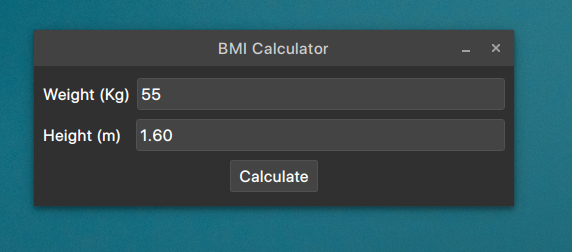
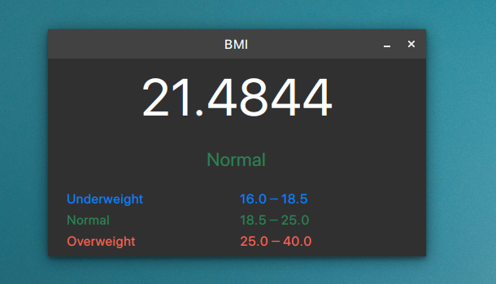

# BMI Calculator
Bmi calculator using Qt c++ toolkit.

### Features
Take input as user `Weight` in **kg** and `Height` in **m**


### Preview




### How to use
You can use both the cli and QtCreator to build this project.

#### CLI
```sh
>> git clone https://github.com/uxlabspk/BMI.git
>> mkidr build && cd build
>> qmake ..
>> make
>> ./BMI
```
#### QtCreator
Download or clone the project.
Open the project using qtcreator.
Run or Build it using `Ctrl + R` or `Ctrl + Shift + B`
